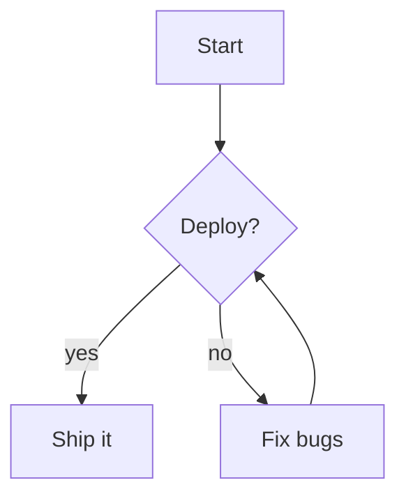
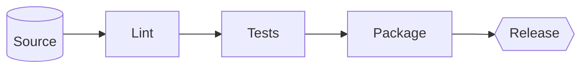
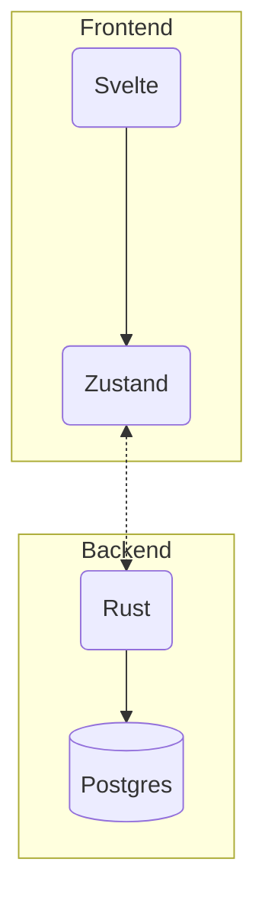

# Flowcharts

## Simple decision

```mermaid
flowchart TD
  A[Start] --> B{Deploy?}
  B -- yes --> C[Ship it]
  B -- no --> D[Fix bugs]
  D --> B
```

## Left-right pipeline

```mermaid
flowchart LR
  src[(Source)] --> lint[Lint]
  lint --> test[Tests]
  test --> pkg[Package]
  pkg --> rel{{Release}}
```

## Grouped subgraphs

```mermaid
flowchart TB
  subgraph Frontend
    UI(Svelte) ----> Store(Zustand)
  end
  subgraph Backend
    API(Rust) --> DB[(Postgres)]
  end
  Store <-.-> API
```
