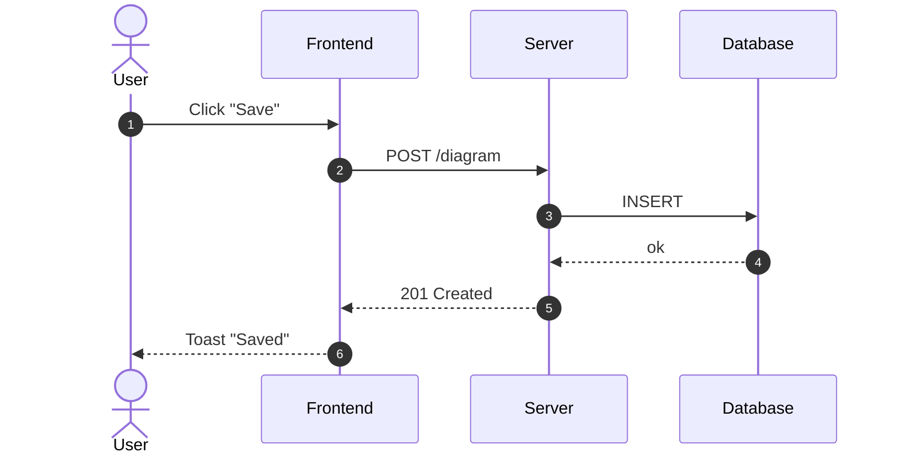
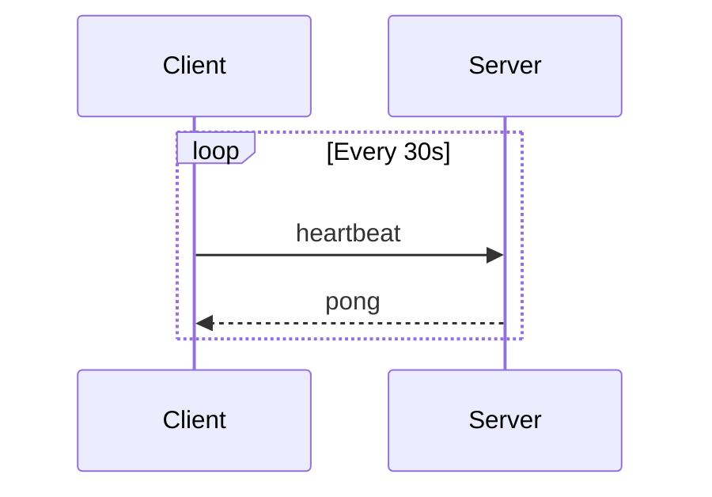

# Sequence diagrams

```mermaid
sequenceDiagram
  autonumber
  actor U as User
  participant F as Frontend
  participant S as Server
  participant D as Database
  U->>F: Click "Save"
  F->>S: POST /diagram
  S->>D: INSERT
  D-->>S: ok
  S-->>F: 201 Created
  F-->>U: Toast "Saved"
```

```mermaid
sequenceDiagram
  loop Every 30s
    Client->>Server: heartbeat
    Server-->>Client: pong
  end
```
