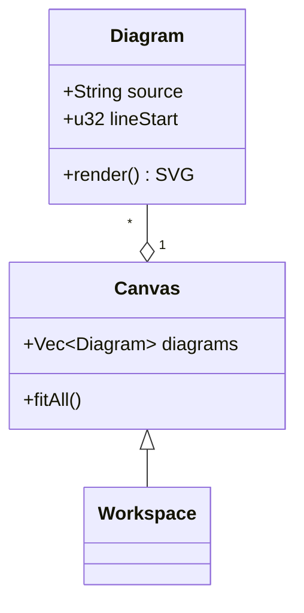
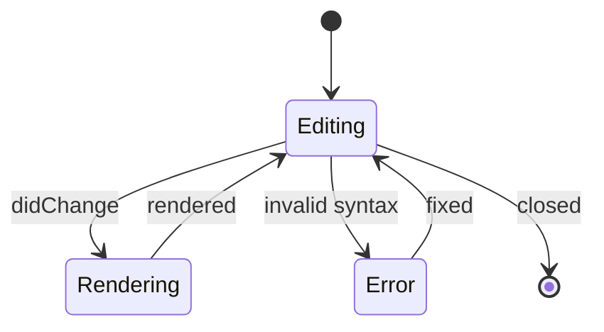

# Class + state

```mermaid
classDiagram
  class Diagram {
    +String source
    +u32 lineStart
    +render() SVG
  }
  class Canvas {
    +Vec~Diagram~ diagrams
    +fitAll()
  }
  Diagram "*" --o "1" Canvas
  Canvas <|-- Workspace
```

```mermaid
stateDiagram-v2
  [*] --> Editing
  Editing --> Rendering: didChange
  Rendering --> Editing: rendered
  Editing --> Error: invalid syntax
  Error --> Editing: fixed
  Editing --> [*]: closed
```
