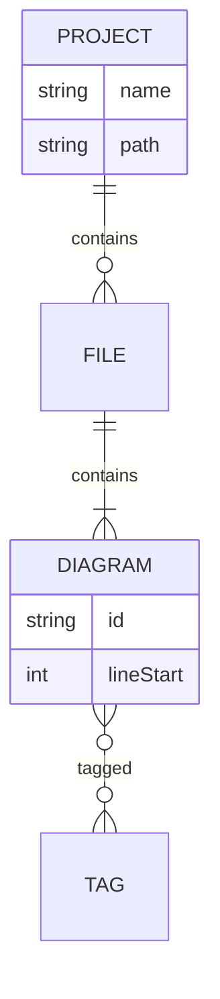
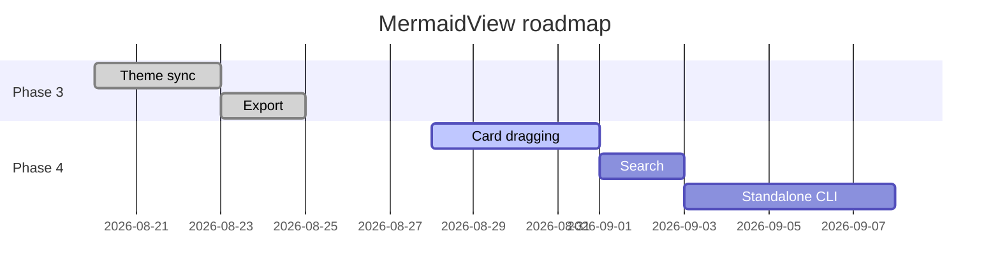

# ER + Gantt

```mermaid
erDiagram
  PROJECT ||--o{ FILE : contains
  FILE ||--|{ DIAGRAM : contains
  DIAGRAM }o--o{ TAG : tagged
  PROJECT {
    string name
    string path
  }
  DIAGRAM {
    string id
    int lineStart
  }
```

```mermaid
gantt
  title MermaidView roadmap
  dateFormat YYYY-MM-DD
  section Phase 3
  Theme sync      :done,    p3a, 2026-08-20, 3d
  Export          :done,    p3b, after p3a, 2d
  section Phase 4
  Card dragging   :active,  p4a, 2026-08-28, 4d
  Search          :p4b, after p4a, 2d
  Standalone CLI  :         p4c, after p4b, 5d
```
