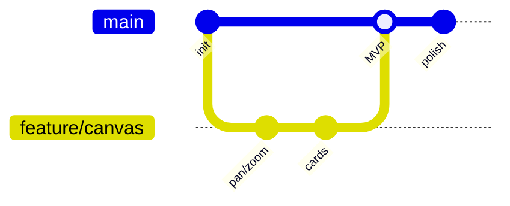
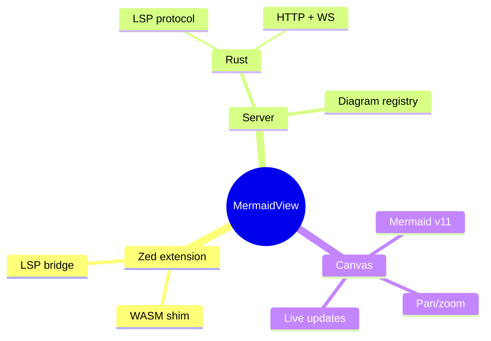

# gitGraph + mindmap

```mermaid
gitGraph
  commit id: "init"
  branch feature/canvas
  commit id: "pan/zoom"
  commit id: "cards"
  checkout main
  merge feature/canvas id: "MVP"
  commit id: "polish"
```

```mermaid
mindmap
  root((MermaidView))
    Zed extension
      WASM shim
      LSP bridge
    Server
      Rust
        LSP protocol
        HTTP + WS
      Diagram registry
    Canvas
      Mermaid v11
      Pan/zoom
      Live updates
```
