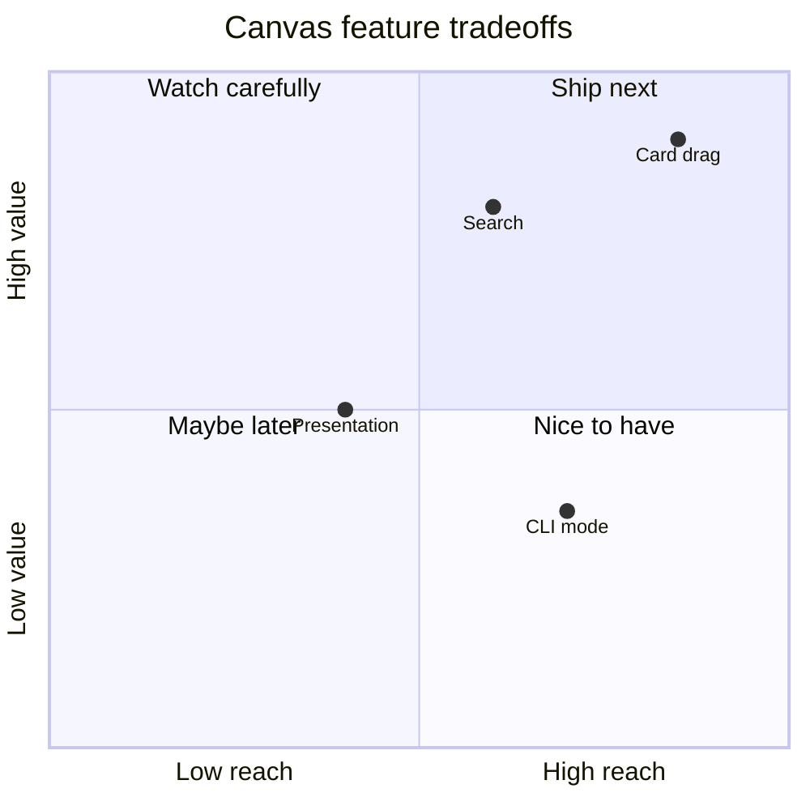
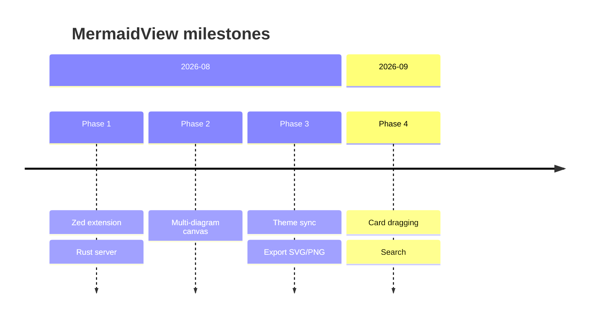

# Quadrant + timeline

```mermaid
quadrantChart
  title Canvas feature tradeoffs
  x-axis Low reach --> High reach
  y-axis Low value --> High value
  quadrant-1 Ship next
  quadrant-2 Watch carefully
  quadrant-3 Maybe later
  quadrant-4 Nice to have
  Card drag: [0.85, 0.9]
  Search: [0.6, 0.8]
  Presentation: [0.4, 0.5]
  CLI mode: [0.7, 0.35]
```

```mermaid
timeline
  title MermaidView milestones
  section 2026-08
    Phase 1 : Zed extension
            : Rust server
    Phase 2 : Multi-diagram canvas
    Phase 3 : Theme sync
            : Export SVG/PNG
  section 2026-09
    Phase 4 : Card dragging
            : Search
```
