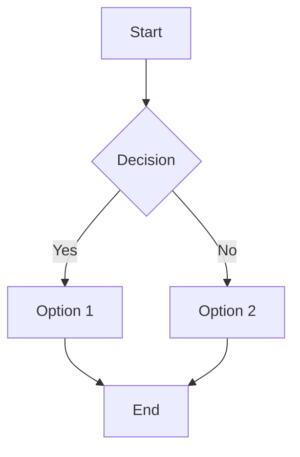
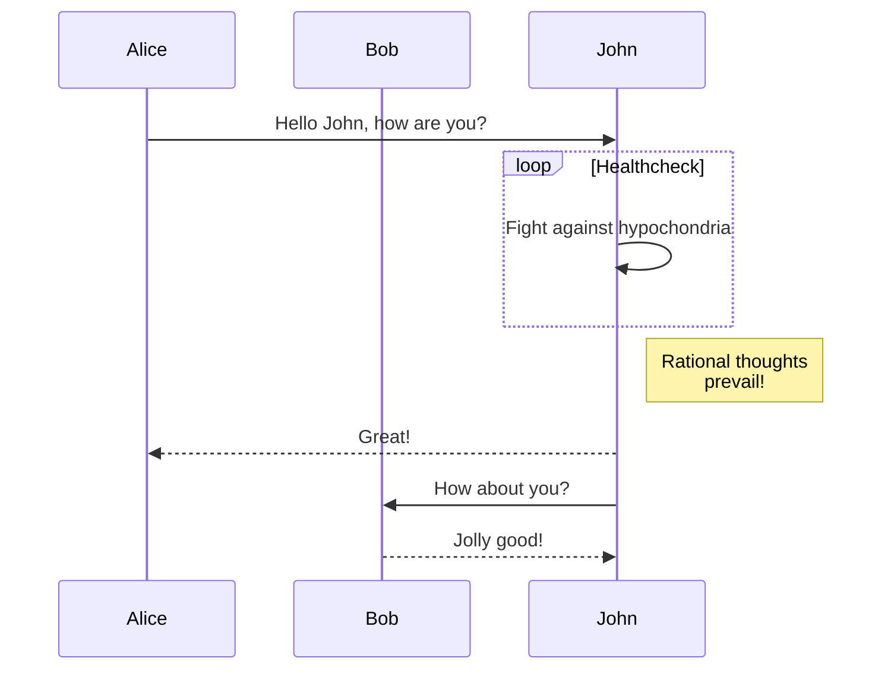
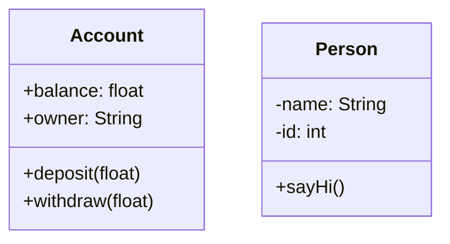
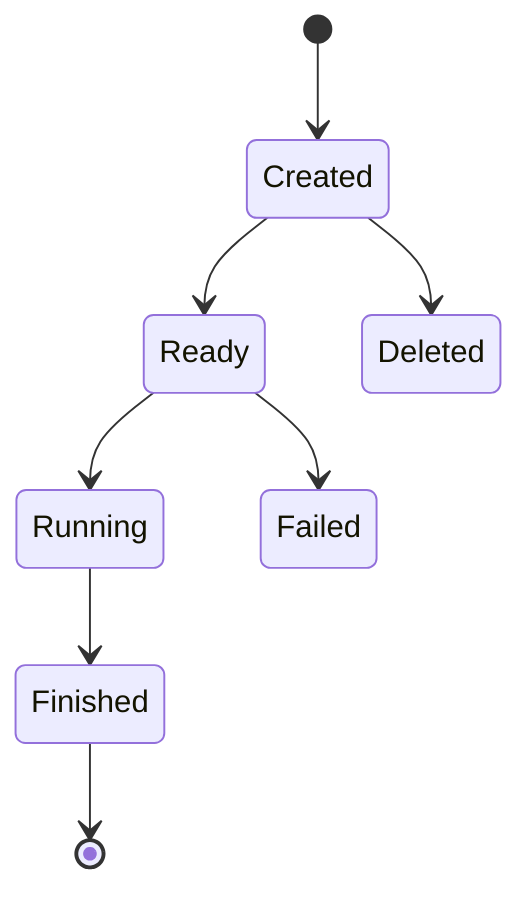

# Test Diagrams - Standalone Mode

## Simple Flow Chart

```mermaid
graph TD
    A[Start] --> B{Decision}
    B -->|Yes| C[Option 1]
    B -->|No| D[Option 2]
    C --> E[End]
    D --> E
```

## Sequence Diagram

```mermaid
sequenceDiagram
    participant Alice
    participant Bob
    Alice->>John: Hello John, how are you?
    loop Healthcheck
        John->>John: Fight against hypochondria
    end
    Note right of John: Rational thoughts <br/>prevail!
    John-->>Alice: Great!
    John->>Bob: How about you?
    Bob-->>John: Jolly good!
```

## Class Diagram

```mermaid
classDiagram
    class Account {
        +balance: float
        +owner: String
        +deposit(float)
        +withdraw(float)
    }
    class Person {
        -name: String
        -id: int
        +sayHi()
    }
```

## State Diagram

```mermaid
stateDiagram-v2
    [*] --> Created
    Created --> Ready
    Created --> Deleted
    Ready --> Running
    Ready --> Failed
    Running --> Finished
    Finished --> [*]
```
